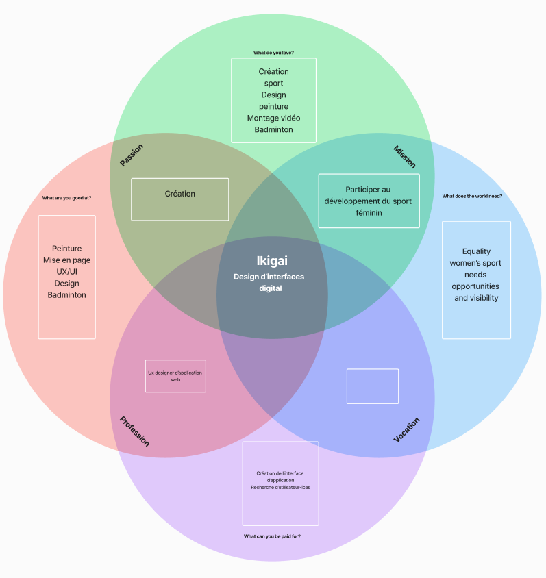

## Ikigai
L'ikigai est un concept japonais qui désigne la raison d'être ou la motivation profonde qui donne du sens à la vie d'une personne. Il se trouve à l'intersection de quatre éléments : ce que l'on aime, ce pour quoi on est doué, ce dont le monde a besoin et ce pour quoi on peut être payé.

## Ux/Ui design
Ce qui me plaît le plus dans le UX/UI design, c'est le pouvoir de simplifier des interfaces complexes pour les rendre utilisables par tous. C'est une approche centrée sur l'humain, où l'objectif est d'améliorer la vie quotidienne des utilisateurs en facilitant leur interaction avec des produits numériques. J'aime l'idée de pouvoir aider les gens à accomplir leurs tâches plus facilement grâce à des interfaces bien pensées, tout en rendant ces expériences agréables et engageantes visuellement.
**mots clé** : wireframes, ergonomies, taxonomie, architecture de l’information, interactivité, prototypage, responsive,  UX, accessibilité
**sous-domaines** : user experience (ux), usability testing, user interface, eye tracking
## Comment j'ai créé ce site
Ce site est développé avec Hugo, un générateur de sites statiques, et repose sur le template Digital Garden. Ce choix me permet d’organiser mon contenu de manière claire et modulaire tout en offrant une flexibilité dans la création d’une expérience utilisateur fluide. Hugo m'a également permis de travailler efficacement, en gardant une structure propre et facile à maintenir.
## Taxonomie
J'ai choisi de simplifier la navigation dans mon site grâce à 3 pages : la page _accueil_, la page _à propos_ et la page _articles_. Depuis la page d'accueil, vous pouvez accéder directement à ces différentes pages ainsi qu'à mon article dédié à l'organisation de ma veille.
